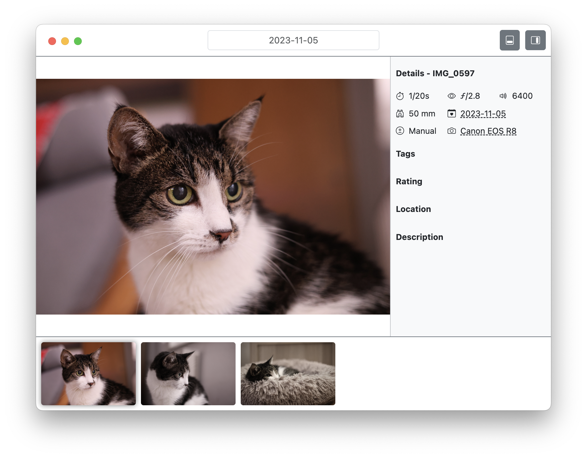

# taro

Current version: `Pre-Alpha v0.1.1`

A small photography culling and tagging app built with Bootstrap and Electron

So far only tested on macOS, but will eventually test on Windows and Linux.

## Goals

Alpha
- [ ] Open a folder of images.
- [ ] Dark mode.
- [ ] Assign meta data to images.

Beta
- [ ] Search for images by meta data.
- [ ] Export images by a certain criteria.

v1.0
- [ ] Polished code (hopefully no bugs).
- [ ] Persisting settings.
- [ ] Multiplatform support.
